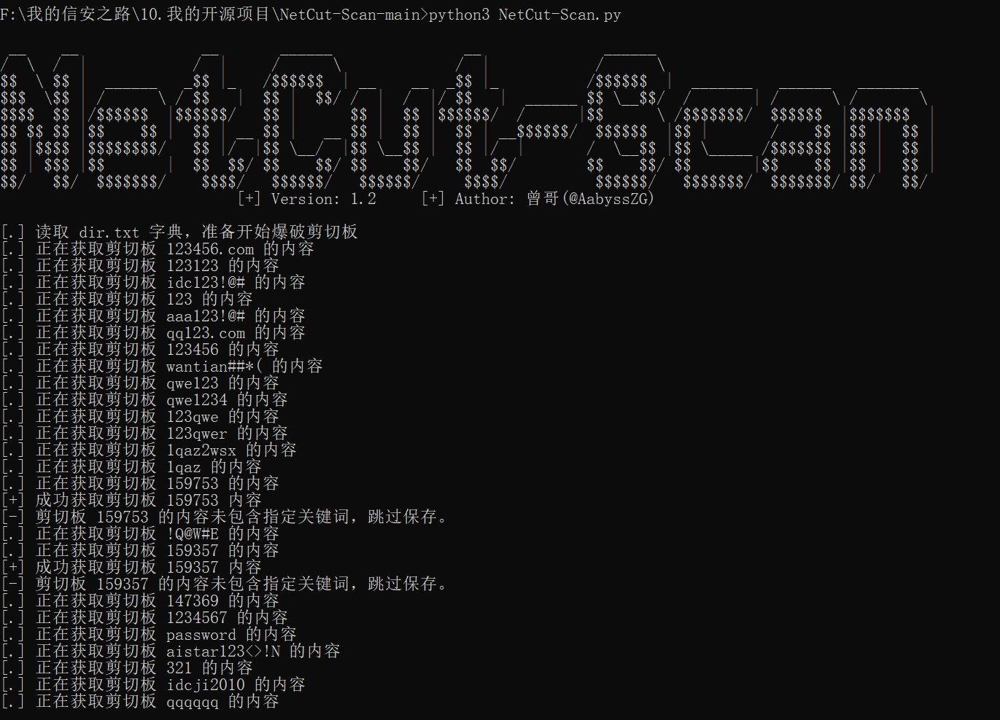

## ✈️ 一、工具概述

[NetCut.cn](https://netcut.cn)是日常办公非常喜欢用的在线工具之一，能够快捷的将指定文本通过该“网络剪切板”的方式传输到另一台设备

- 但在方便快捷的背后，往往牺牲的是安全！
- 在传输剪切板的过程中，总有人为了贪图方便，上传自己的账号密码以及其他敏感信息，总觉得没有人会看到，其实都被监控。
- 本项目的警示意义便在于以上两点，如您使用本项目，将同意下方的免责条款，技术不是拿来作恶的！

## 📝 二、TODO

* [x] 如果字典跑完了，会等待3600秒（60分钟）再开始新一轮的剪切板监控
* [x] 通过正则表达式匹配剪切板的内容，如果匹配敏感内容成功就输出到 `Find` 目录
* [x] 能根据字典 `dir.txt` 自动去尝试爆破剪切板，如果剪切板有内容会输出到 `ID_Out.txt`

## 🚨 三、安装Python依赖库

```
pip install -r requirements.txt
```

如果pip安装速度慢，可以采用国内源进行安装：

```
pip install -r requirements.txt -i https://pypi.tuna.tsinghua.edu.cn/simple/
```

## 🐉 四、工具使用

```
python3 NetCut-Scan.py
```



- 根据字典 `dir.txt` 自动去尝试爆破剪切板，如果剪切板有内容会输出到 `ID_Out.txt`
- 通过正则表达式 `\b(email|file|user|pass|url|key|密码|账户|账号|测试|文件|文档|网盘)\b` 匹配剪切板的内容，如果匹配敏感内容成功就输出到 `Find` 目录

**如果想要修改和使用本项目，请自行查看代码并保证遵守免责声明！**

## 🖐 五、免责声明

1. 如果您下载、安装、使用、修改本工具及相关代码，即表明您信任本工具
2. 在使用本工具时造成对您自己或他人任何形式的损失和伤害，我们不承担任何责任
3. 如您在使用本工具的过程中存在任何非法行为，您需自行承担相应后果，我们将不承担任何法律及连带责任
4. 请您务必审慎阅读、充分理解各条款内容，特别是免除或者限制责任的条款，并选择接受或不接受
5. 除非您已阅读并接受本协议所有条款，否则您无权下载、安装或使用本工具
6. **您的下载、安装、使用等行为即视为您已阅读并同意上述协议的约束**
